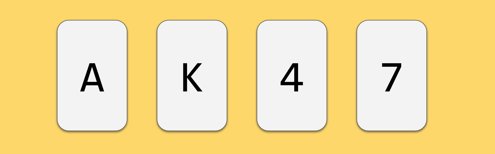

> Each card has a letter on one side and a number on the other side.  
> **Claim: if a card shows a vowel on one face, then its opposite face is an even number**   
> Which card or cards must be turned over to test if this claim is true or false?   

## Think about this for 2 minutes


```python
# Possible solutions:


```

## Next time
We have covered the different **datastructures** in python (list, tuple, set, dict), and you will be able to  to implement an algorithm that can check if a set of cards apply to this rule or not. 

## Later this semester
You are going to refactor your solution into being more effecient regarding to time, and memory, and you are going to make the code have a more "pythonic" feeling. This will primarely be through the use of **list comprehensions** and **generator expressions**. 
