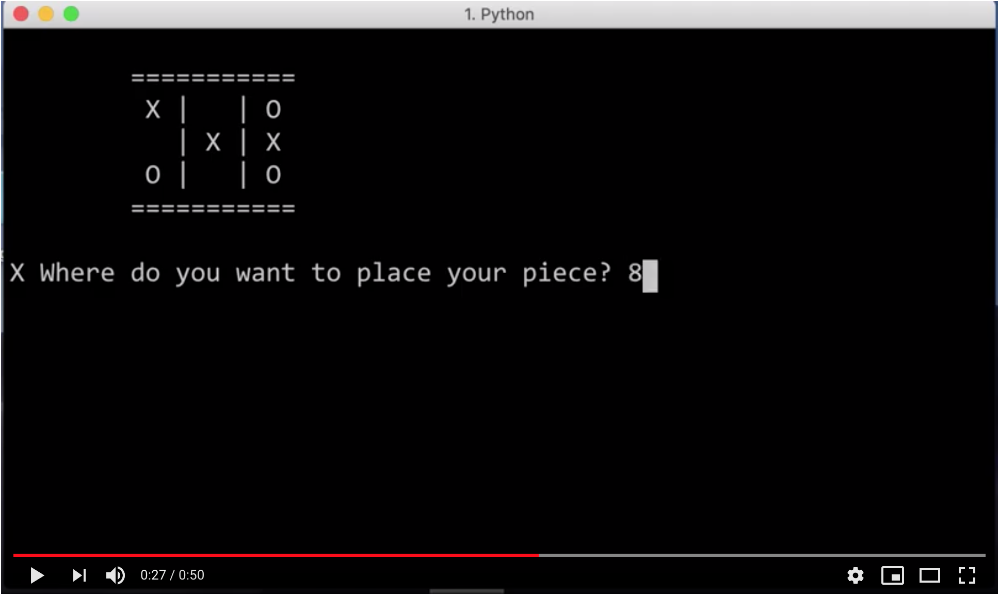

# Tic Tac Toe

Your job is to create the folowing application.

**https://youtu.be/d_ssPkgNbZE**

The rules of the games can be found [here](https://en.wikipedia.org/wiki/Tic-tac-toe)

## OOP  
Since this game deals with state, and since we today have been working with classes and objects, you should create this game in an OOP manner.  

Please improve the game if you can :)  
