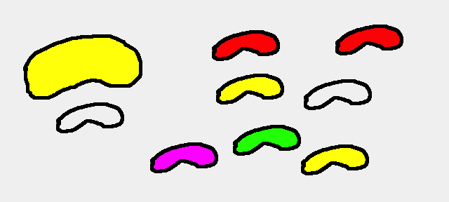

# Jelly Beans  
## Exercise: Python Class, Protocols, Properties, Overload  

Imagine a game where different jelly beans are floating around.   
When they bump into each other they melt together and one of them gain mass, the other looses mass.  



The old one does not dissapear but becomes a Ghost, its mass becomes 0 (maybe a little gas like state).  

If the main Jelly Bean hits a ghost jelly bean, the ghost jelly bean regains its original state, and the mass it gains will be deducted from the main Jelly Bean (it will shrink in size).  
  
Some Ghost Jellies are born ghosts. If you hit one of these, half of your mass will be stolen by that ghost.  
  
The game is won when your jelly bean is the only one with a mass.   
The Game is lost if you do not have any more mass.  
  
YOUR JOB IS NOT TO CREATE THIS GAME, but to create a class that can be used in this game by someone else.  
Your job is also to write pythonic code, using python protocols, properties, overloading etc.  

### Assignment:
   
> Create a JellyBean class.  
> When initialized you will create a jelly bean with a mass.         
> You should be able to add 2 jelly beans together thus the mass of the one of them will increese.   
> The mass of the other one will be 0, and should not remember its former state.   

> The class should also be able to deduct 2 jelly beans. If a gas like jelly bean hit your jelly bean it should regain its former mass and yours should decrease.  

> The object should be able to when asked tell its state.  

#### X-tra assignemnets:
> The "gas like Jelly Beans" will over time gain a little mass. Small jelly fragments are lying around and can be added with the plus operator to. the fragments are not objects of the Jelly Bean Class but of another more simple class called Jelly_fragment. This class has a fixed mass of 1, and it should not be changed. If the Jelly Bean "Ghost" at some poit regain they old mass they are only allowed to keep "over time gained mass" corosponding to 2% of the original mass. If it succeceds it is discarded. 

> Add the functionallity of being able to write this code in the client. 
````python
    val = j2 in me
    Where me and j2 are jelly objects
````
  
  
> You can already write ```` me == j2  ```` -> and get a return value of True or False.   
Create an implementation that when writing ```` me == j2 ```` checks if the mass of the 2 objects are alike.
Create an implementation that when writing ```` me < j2 ```` checks if the mass of 'me' is less than 'j2'.  
Do the same for ````  >, !=, <=, >= ````  


